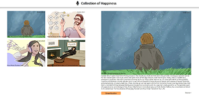

# Collection of Happiness

## What do you read in this file?
In this file you will read about the final assignment of period 2.3 Deepdive Front-end, which strategy I have implemented and images of the design and realisation. 

## Final assignment
For this final assignment I had to make a user-friendly webpage that collects
populair podcasts under the name of "The Science of Happiness." The tool features
a header, a main which includes a left/rightsection and a footer. The leftsection
of the site shows 4 random episodes of "The Science of Happiness." The rightsection
consists of a detailinformation which has 1 of 4 random episodes in the 
form of an image, summary, download button and a source link. All data was
extracted from a Json-file and all images are converted in webp.

## Which methods did I use for this project
The methods that I used in this project are:
- The design was adhered to in the realisation of the app
- It is written in [OOP](https://developer.mozilla.org/en-US/docs/Learn/JavaScript/Objects/Classes_in_JavaScript)
- The HTML is written [Semantic](https://www.w3schools.com/html/html5_semantic_elements.asp) and is written according to the [BEM](https://getbem.com/introduction/) methodology
- The font-type is Ubuntu
- The style is implemented in [Scss](https://sass-lang.com/), which includes abstracts, components, mixins and variables.
- Json is used in this project
- The site is responsive

## Extras 
I have added an extra feature in this assignment. There will be not more than one of the same episodes in the leftsection. I made it with a let variable which is an empty array and every time the for loop begins to run, it will check if the same number is already used. When this is the case, the variable will make a new random number with the randomizer function. You can check the code in my Javascript file on line 108 till 119.

## Design and mobile
 

## Uitwerking
 